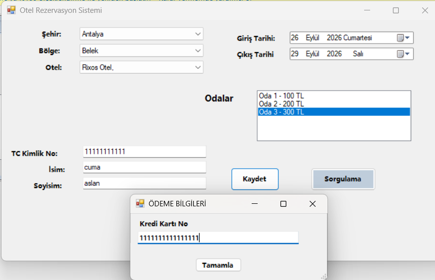
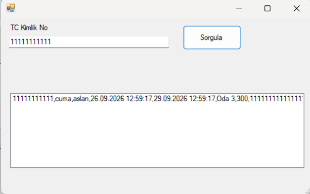

# 🏨 Otel Rezervasyon Sistemi

Visual Studio üzerinde C# (Windows Forms) kullanılarak geliştirilmiş, otel odası yönetimi ve müşteri rezervasyon süreçlerini dijitalleştiren masaüstü yazılım projesi.

## 📸 Arayüz Görüntüleri

### Rezervasyon ve Kayıt Ekranı

### Müşteri Sorgulama Ekranı

## 🚀 Özellikler
* **Müşteri Yönetimi:** Yeni müşteri kaydı oluşturma, TC Kimlik numarası ile geçmiş kayıtları sorgulama.
* **Oda Seçimi ve Fiyatlandırma:** Boş odaların listelenmesi ve fiyat takibi.
* **Rezervasyon İşlemleri:** Giriş/Çıkış tarihleri belirleme ve ödeme bilgileri (Kredi Kartı) alma işlemleri.

## 🛠️ Kullanılan Teknolojiler
* **Geliştirme Ortamı:** Visual Studio
* **Dil & Altyapı:** C# (.NET Framework / Windows Forms)

## ⚙️ Kurulum ve Çalıştırma
Bu projeyi kendi bilgisayarınızda test etmek için:

1. Repoyu bilgisayarınıza klonlayın.
2. Klasör içerisindeki `HotelRezervasyon.sln` dosyasını Visual Studio ile açın.
3. Projeyi derleyip (Build) çalıştırarak sistemi kullanmaya başlayın.
